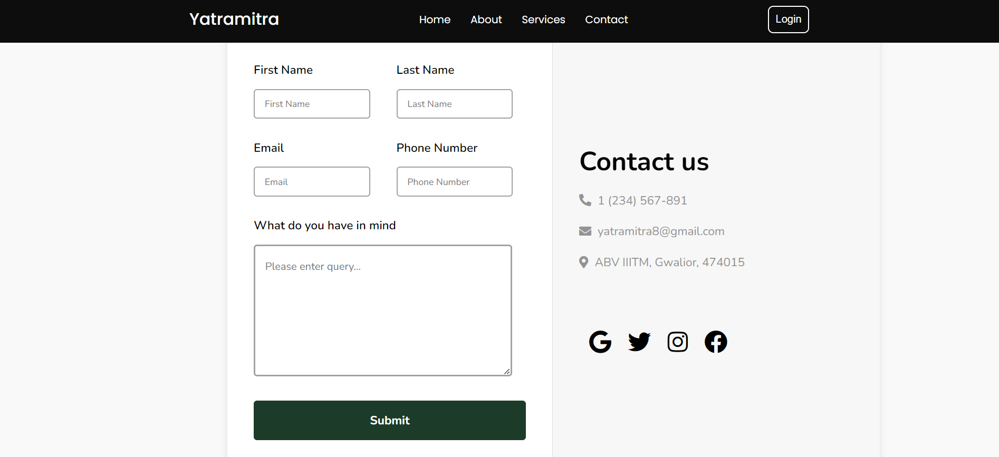
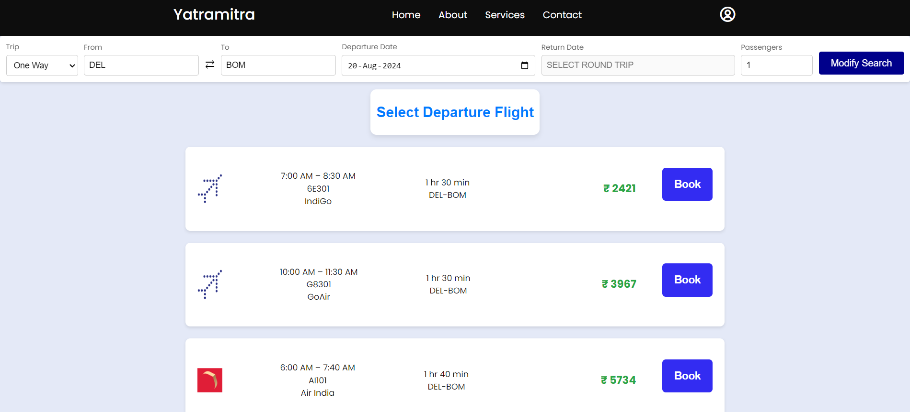
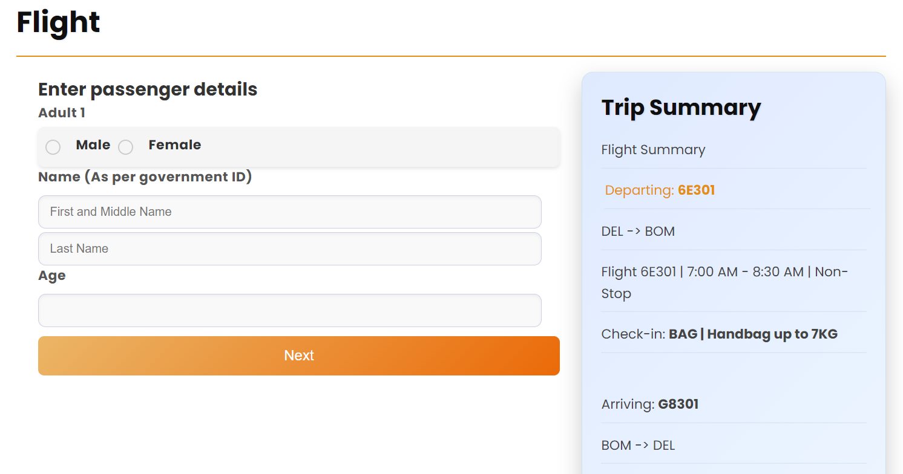
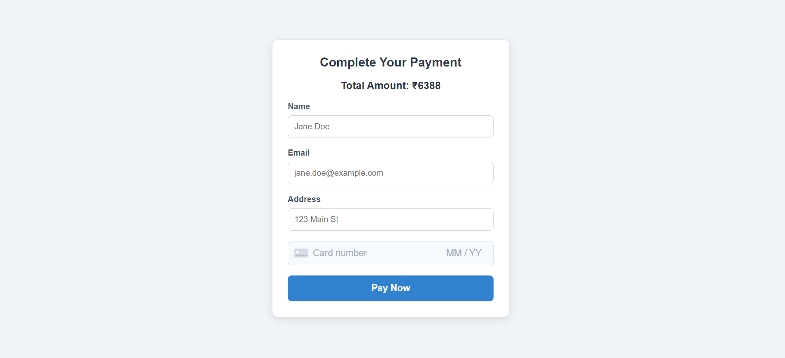
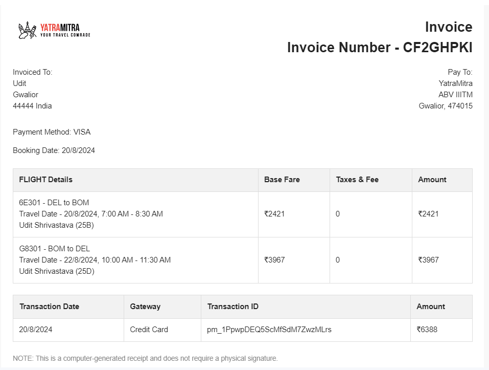

Here’s a sample README file for your repository:

---

# Yatramitra Frontend

**Yatramitra** is a travel website frontend built using vanilla HTML, CSS, and JavaScript. The website provides users with the ability to book train, flight, and bus tickets. It also integrates Stripe for secure payment processing and features various interactive elements for a seamless user experience.

## Features

- **Booking System:** Users can book train, flight, and bus tickets.
- **Payment Integration:** Utilizes Stripe for secure payment transactions.
- **Dynamic Navbar:** A responsive and interactive navigation bar.
- **Authentication:** User authentication for personalized experience.
- **Homepage Video:** An introductory video showcased on the homepage.
- **Responsive Design:** Optimized for various devices and screen sizes.

## Installation

1. Clone the repository:
   ```bash
   git clone https://github.com/D3athSkulll/yatramitra-frontend.git
   ```
2. Navigate to the project directory:
   ```bash
   cd yatramitra-frontend
   ```
3. Open `index.html` in your web browser to view the website.

## Usage

1. Open the `index.html` file in your browser to access the homepage.
2. Navigate through the dynamic navbar to access different sections.
3. Use the booking forms to reserve train, flight, or bus tickets.
4. Proceed to checkout to complete payments via Stripe.

## Screenshots
Here are some screenshots of the Yatramitra website:








## Contributing

1. Fork the repository.
2. Create a new branch for your feature or bug fix:
   ```bash
   git checkout -b feature/my-feature
   ```
3. Commit your changes:
   ```bash
   git commit -am 'Add new feature'
   ```
4. Push to the branch:
   ```bash
   git push origin feature/my-feature
   ```
5. Create a new Pull Request.

## License

This project is licensed under the MIT License - see the [LICENSE](LICENSE) file for details.

## Acknowledgments

- **Stripe** for payment processing.
- **Open Source Community** for various libraries and tools.

---

Feel free to adjust any sections based on your specific needs!
